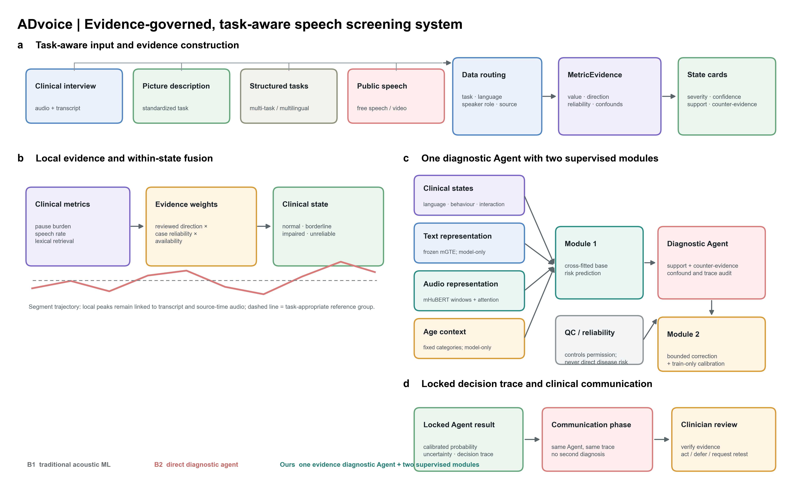

# ADvoice

<p align="center">
  
</p>

Task-aware, evidence-governed speech screening for traceable cognitive-risk assessment.

## Overview

ADvoice converts audio, transcripts, task metadata, and speaker roles into reviewable clinical evidence. Instead of mapping a flat feature vector directly to a diagnosis, the framework routes each recording by task, constructs MetricEvidence objects, estimates clinical StateCards, and preserves a shared trace from source segment to screening recommendation.

The system is designed for screening and referral support. It is not an Alzheimer’s disease diagnostic device.

## Key contributions

- **Task-aware routing:** separates clinical interviews, picture descriptions, structured tasks, and public speech before interpreting metrics.
- **MetricEvidence:** attaches direction, reliability, missingness, confounds, and report permission to every metric.
- **State-guided fusion:** combines related evidence into clinically named states before cross-branch fusion.
- **Shared trace:** links the Agent conclusion and clinician-facing report back to the same segments, metrics, and states.

## Construction flow

1. Route the input by task, language, role, and modality.
2. Extract acoustic, speech-behavior, language, and interaction evidence.
3. Calibrate metrics using training-fold healthy references.
4. Estimate StateCards under reliability and confound constraints.
5. Fuse state branches and run bounded diagnostic-Agent reasoning.
6. Generate a screening report with supporting evidence, counterevidence, uncertainty, and follow-up suggestions.

## Website

```bash
git clone https://github.com/Jewelina95/ADvoice.git
cd ADvoice
npm install
npm run dev
```

Open `http://localhost:3000`.

## Updating the research snapshot

The site does not store a second hand-written copy of the metric and state definitions. After the parent research pipeline changes, regenerate the public example:

```bash
npm run sync:data
npm test
```

The fusion model is currently under revision. The public repository intentionally excludes internal benchmark comparisons, failure-mode reports, raw patient data, and identifiable records.
